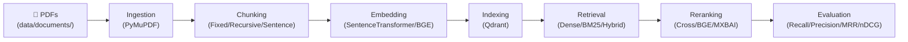

<div align="center">

# *RAG-Bench*


**A modular, data-driven benchmarking framework for evaluating and optimizing Retrieval-Augmented Generation (RAG) pipelines.**

</div>

---

> **Note**: This project specifically focuses on benchmarking the **Retrieval** architecture of a RAG system (Chunking, Embedding, Searching, and Reranking). It does **not** include an LLM (Large Language Model) or natural language generation step, acting purely as a support system to optimize the context provided to an LLM.

## Why This Project Exists❓
Modern AI applications increasingly rely on *Retrieval-Augmented Generation (RAG)* to ground Large Language Models (LLMs) with private data. However, developers face a paralyzing number of architectural choices: which embedding model to deploy, how to chunk documents, and whether to implement complex reranking steps. 

**RAG-Bench** replaces assumption-based engineering with hard data. It provides an automated, reproducible testing environment that empirically proves which architectural decisions actually yield the highest retrieval quality for your specific dataset.

---

## 🎯 Objective
The primary objective of this project is to provide a comprehensive, end-to-end evaluation suite for RAG systems. While measuring the **speed vs. accuracy trade-off** is a key focus, RAG-Bench aims to achieve several broader goals:

1. **Component Isolation**: Quantify the exact impact of swapping individual components (e.g., changing a chunking strategy or adding a CrossEncoder) on the overall pipeline.
2. **Metric-Driven Optimization**: Score configurations rigorously against established Information Retrieval (IR) metrics, including Recall@K, Precision@K, Mean Reciprocal Rank (MRR), and Normalized Discounted Cumulative Gain (nDCG@K).
3. **Resource Efficiency**: Identify models and strategies that maximize search relevance without imposing unnecessary computational overhead, huge database footprints, or latency penalties.
4. **Reproducibility**: Establish a standardized, plug-and-play testing workflow that can be seamlessly adapted to custom datasets and domain-specific documents.

---

## 🗂️ Repository Structure

```text
├── data/
│   ├── metadata/
│   └── queries/
│       └── queries.json
├── notebooks/
├── outputs/
│   ├── chunking_03/
│   ├── embedding_02/
│   ├── pipeline_05/
│   ├── reranking_04/
│   └── retrieval_01/
├── reports/
├── scripts/
├── src/
│   ├── chunkers/
│   ├── embeddings/
│   ├── evaluation/
│   │   ├── metrics/
│   ├── indexing/
│   ├── ingestion/
│   ├── models/
│   ├── parser/
│   ├── pipeline/
│   ├── rerankers/
│   ├── retrieval/
│   │   ├── fusion/
│   ├── settings/
│   ├── utils/
│   ├── validators/
│   ├── vectordb/
├── .gitignore
├── README.md
└── docker-compose.yml
```

---

**Workflow**:



**Corpus**: 25 PDF documents (research papers, textbooks, documentation) totalling **31,739 chunks** and **263 evaluation queries** with ground-truth relevant documents.

---

## 📦 Dataset & Data Collection

The evaluation dataset for this project consists of 25 large PDF documents.<br>
**Note:** The current ingestion pipeline supports PDF files only.

The data was meticulously collected from highly technical sources to challenge the retrieval system, including:
- Academic research papers sourced from `arXiv`.
- Official technical documentations (e.g., `PostgreSQL 18.X`).

To use this framework with your own data, place your PDF files into your configured document directory (e.g., `data/raw/`) and update `data/queries/queries.json` with corresponding ground-truth questions and document IDs.

---

## 🛠️ Setup & Installation

### Execution Environments: Local vs. Cloud (Colab)

This project is designed to be highly portable. Here is a brief guide on what environment to use and when:
- **Local Machine (Primary)**: Ideal for writing code, testing the retrieval pipeline, running fast lexical searches (BM25), and querying a database that has already been built.
- **Google Colab (Heavy Compute)**: Generating dense semantic embeddings (e.g., `BGE-small`) across tens of thousands of document chunks is computationally expensive. Use Colab (equipped with a free T4 GPU) to perform heavy indexing in minutes rather than hours. Once indexed into a remote instance like Qdrant Cloud, you can safely switch back to querying from your local machine.

### Local Setup (Docker + Qdrant)

1. **Clone the repository**:
   ```bash
   git clone https://github.com/ver1619/rag-bench.git
   cd rag-bench
   ```
2. **Install Dependencies**:
   Ensure you have Python 3.12+ installed. Create a `requirements.txt` file and include the following essential packages:
   ```text
   langchain-text-splitters
   nltk
   pymupdf
   sentence-transformers
   torch
   qdrant-client
   rank-bm25
   python-dotenv
   ```
   Then install them:
   ```bash
   pip install -r requirements.txt
   ```
3. **Start Local Qdrant**:
   The project uses Qdrant as its vector database. Start it locally using Docker:
   ```bash
   docker-compose up -d
   ```
4. **Run Evaluations**: 
   Use the Python scripts located in the `scripts/` directory (e.g., `scripts/pipeline.py`, `scripts/evaluate.py`, etc.) to build the pipeline and run benchmarks.


---

## ⚙️ CLI Operations

The RAG-Bench framework is driven by a flexible command-line interface (CLI). These scripts allow you to rapidly swap modular components—such as the embedding model, chunking strategy, and reranker—using simple flags without modifying the underlying Python code. 

### `scripts/pipeline.py` — Full Pipeline (Build + Index + Retrieve)

The primary entry point. Runs the entire pipeline end-to-end.

```
python -m scripts.pipeline --embedding-model "sentence-transformers/all-MiniLM-L6-v2" --chunker recursive --retriever dense --reranker cross --dataset "<path_to_data>" --query "What is AIML" --top-k 8 --limit 10 --overwrite-index
```

| Argument | Type | Default | Description |
|----------|------|---------|-------------|
| `--embedding-model` | str | **required** (no default) | embedding model |
| `--chunker` | choice | `fixed` | `fixed`, `recursive`, `sentence` |
| `--retriever` | choice | `dense` | `dense`, `bm25`, `hybrid` |
| `--reranker` | choice | `none` | `none`, `cross`, `bge`, `mxbai` |
| `--query` | str | `"What is PostgreSQL Full Text Search?"` | Search query |
| `--top-k` | int | `5` | Number of results |
| `--overwrite-index` | flag | `false` | Rebuild the Qdrant collection |

---

### `scripts/evaluate.py` — Benchmark Evaluation

Evaluates retrieval quality against ground-truth. **Does NOT rebuild the index** — uses the existing Qdrant corpus and reads `config.json` for the embedding model.

```
python -m scripts.evaluate --retriever dense --reranker cross --dataset "<path_to_data>" --top-k 8 --limit 10
```

| Argument | Type | Default | Description |
|----------|------|---------|-------------|
| `--retriever` | choice | `dense` | `dense`, `bm25`, `hybrid` |
| `--reranker` | choice | `none` | `none`, `cross`, `bge`, `mxbai` |
| `--dataset` | str | `data/queries/queries.json` | Evaluation dataset path |
| `--top-k` | int | `5` | Top-K for metrics |
| `--limit` | int | `None` (all) | First N queries only |

**Metrics computed**: Recall@K, Precision@K, MRR, nDCG@K, Latency (ms).

---

## 🧰 Methods & Models

The RAG-Bench framework evaluates a diverse matrix of algorithms and models across the retrieval pipeline. The table below outlines every specific strategy integrated and tested within our benchmark.

| Embedding Models | Retriever Methods | Chunking Strategies | Rerank Models |
|------------------|-------------------|---------------------|---------------|
| `all-MiniLM-L6-v2` | Dense (Semantic) | Fixed | None |
| `all-mpnet-base-v2` | BM25 (Lexical) | Recursive | CrossEncoder (ms-marco) |
| `bge-small-en-v1.5` | Hybrid (RRF) | Sentence | BGE Reranker |
| `bge-base-en-v1.5` | | | MXBAI Reranker |

---

## 🔬 Experiment Reports & Insights

Conducted a series of 5 sequential experiments to isolate and test specific parts of the RAG pipeline. 

| Experiment  | Goal | Key Findings | Report |
|-----------------|------|---------------------|-----------------|
| **01: Baseline Retrieval** | BM25 vs Dense vs Hybrid | Dense retrieval outperformed lexical (BM25) search, matching Hybrid accuracy but executing 3x faster. | [View Report](./reports/retrieval_report.md) |
| **02: Embedding Model** | MiniLM vs mpnet vs BGE-small | `BGE-small` dominated accuracy metrics while maintaining low latency and a small dimensional footprint. | [View Report](./reports/embedding_report.md) |
| **03: Chunking Strategy** | Fixed vs Recursive vs Sentence | `Recursive` chunking yielded the best context for the AI, improving accuracy without exploding database storage. | [View Report](./reports/chunking_report.md) |
| **04: Reranking Impact** | None vs CrossEncoder vs BGE vs MXBAI | `CrossEncoder (ms-marco)` provided the best balance, increasing top-result precision with minimal latency penalties. | [View Report](./reports/reranker_report.md) |
| **05: Pipeline Showdown** | Baseline vs Fully Optimized Pipeline | The optimized pipeline achieved a 13% jump in Precision over the baseline, with only a ~36ms penalty in speed. | [View Report](./reports/pipeline_report.md) |

> **Execution Environment:** All benchmark experiments were executed in **Google Colab** leveraging a **T4 GPU**, while data was stored remotely in **Qdrant Cloud**. This cloud-based environment was chosen because generating dense semantic embeddings (like `BGE-small`) over 30,000+ document chunks is computationally heavy. Using a GPU reduced indexing time from hours on a standard CPU down to just a few minutes, allowing for rapid, iterative benchmarking.
---

## 🔍 Key Learnings

- **Lexical search falls short on technical context**: While traditional BM25 keyword matching is fast, it severely underperforms semantic (dense) retrieval when handling the complex, domain-specific queries common in technical documentation and academic papers.
- **Domain-tuned architecture beats sheer parameter size**: The massive, general-purpose `mpnet-base` embedding model was easily outperformed by the much smaller `BGE-small` model, proving that utilizing a model specifically optimized for retrieval tasks yields better accuracy and faster indexing.
- **Cross-Encoder reranking delivers the highest ROI**: While secondary reranking stages inherently add latency, introducing a `ms-marco` CrossEncoder boosted top-5 precision by over 13% while only adding a negligible ~36ms overhead, proving to be the most cost-effective accuracy upgrade.
- **Context-aware chunking wins over rigid slicing**: Hard-slicing documents by a fixed character count often splits sentences in half, confusing the model. The `Recursive` chunking strategy—which keeps paragraphs and thoughts intact—provided measurably better context retrieval without inflating the database size.
- **Hybrid search is powerful, but computationally expensive**: Combining BM25 and Dense retrieval via Reciprocal Rank Fusion (RRF) yielded top-tier accuracy, but the latency cost was almost 3x higher than using a pure Dense approach. Dense retrieval coupled with a fast Reranker proved to be a far more efficient pipeline.
- **GPU acceleration is critical for indexing, but optional for retrieval**: While building the initial vector database required a T4 GPU to process tens of thousands of chunks rapidly, querying the optimized pipeline is lightweight enough (~200ms) to run comfortably on standard CPU infrastructure in production.

---

## 🌟 Project Outcome

The project successfully demonstrated that an optimized, data-driven approach to component selection fundamentally transforms retrieval performance. By replacing standard defaults with a recursive chunker, a specialized BGE embedding model, and a CrossEncoder reranking stage, the final RAG pipeline achieved a massive **13.0% increase in top-5 precision**. Most importantly, it accomplished this accuracy leap without sacrificing speed, maintaining a highly responsive query latency of **~209ms** perfectly suited for real-time production applications.