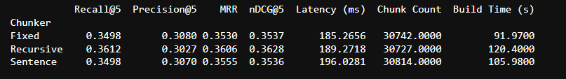
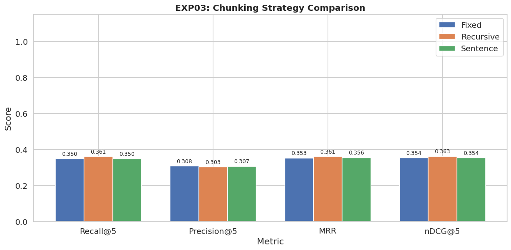
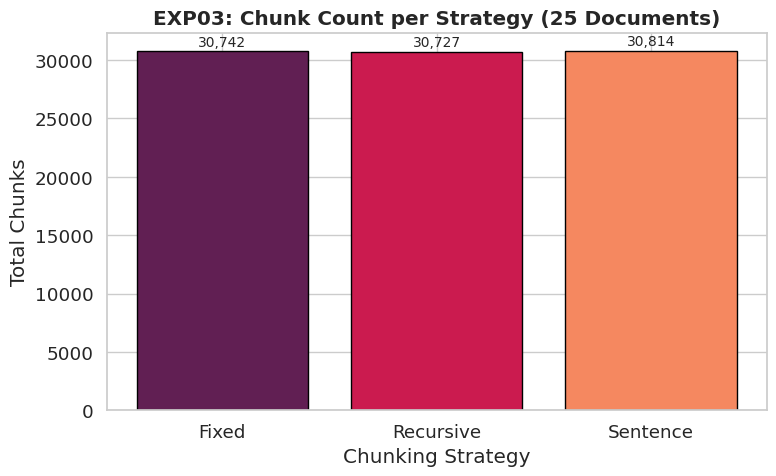

# Experiment 03: Chunking Strategy Analysis

### Objective
The choice of chunking strategy directly influences the semantic coherence of each chunk, retrieval accuracy, and storage requirements. This experiment evaluates three commonly used chunking strategies— `Fixed`, `Recursive`, and `Sentence-based chunking` —to determine which approach provides the best balance between retrieval effectiveness and indexing efficiency for the benchmark dataset.

Chunking is a fundamental preprocessing step in Retrieval-Augmented Generation (RAG) systems, as documents must be segmented into smaller units before embedding and indexing.

---

### Chunking Strategies

**Fixed Chunking**: Documents are divided into equal-sized chunks based on a predefined character limit, irrespective of sentence or paragraph boundaries. Although computationally simple and efficient, this approach often fragments semantic context, potentially reducing retrieval quality.

**Recursive Chunking**: Recursive Chunking – Documents are recursively split using a hierarchy of natural separators such as paragraphs, line breaks, and sentences before falling back to fixed-size segmentation when necessary. This strategy preserves contextual coherence by maintaining complete thoughts within each chunk, making it well suited for semantic retrieval.

**Sentence Chunking**: Documents are segmented at sentence boundaries, ensuring that each chunk contains complete sentences. While this preserves grammatical structure, individual chunks may lack sufficient contextual information when relevant content spans multiple consecutive sentences.

---

### Results Data
Here is the raw data table from the benchmark run:

---

### Accuracy Comparison

**What this means:**
The chart shows how well the system found relevant information based on how the documents were sliced.

The benchmark demonstrates that **Recursive Chunking** consistently achieves the highest retrieval metrics across all evaluation measures. Unlike Fixed Chunking, which may split sentences or paragraphs arbitrarily, Recursive Chunking attempts to preserve natural document boundaries. As a result, each chunk contains more complete semantic information, enabling the embedding model to generate richer vector representations and improving the likelihood of retrieving relevant documents. 
Fixed Chunking occasionally fragments important contextual information, while Sentence Chunking may generate overly small chunks that lack sufficient surrounding context. Both factors reduce the quality of semantic matching during retrieval.

---

### Data Footprint (Chunk Count)

**What this means:**
This chart shows how many "slices" each method created from the same set of 25 documents.
- While they all produced roughly ~30,000 chunks, the **Recursive** method actually produced slightly fewer chunks than the Fixed method. 
- Chunk count directly affects storage consumption, indexing time, and retrieval efficiency. Producing excessive chunks increases the number of embeddings stored within the vector database, leading to higher storage requirements and longer indexing times. Despite generating slightly fewer chunks than Fixed Chunking, Recursive Chunking simultaneously achieved higher retrieval accuracy, indicating that improved semantic organization can reduce storage overhead without compromising retrieval performance.

---

### Conclusion
The results suggest that preserving semantic structure is more important than maintaining uniform chunk sizes. Retrieval models perform best when embeddings represent complete ideas rather than fragmented text. These findings indicate that intelligent chunk boundary selection contributes more to retrieval effectiveness than simply controlling chunk length. 
`Recursive Chunking` provides the most effective balance between retrieval quality and indexing efficiency. It consistently outperformed Fixed and Sentence Chunking across all retrieval metrics while maintaining a comparable storage footprint. Since it preserves contextual coherence without significantly increasing the number of indexed chunks, Recursive Chunking was adopted as the default preprocessing strategy for subsequent experiments.