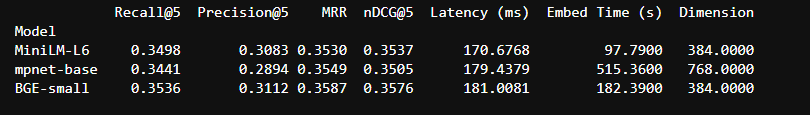
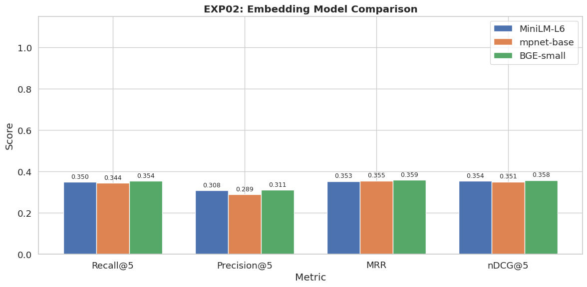
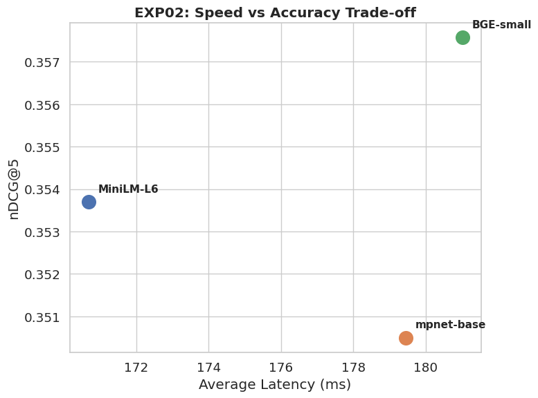
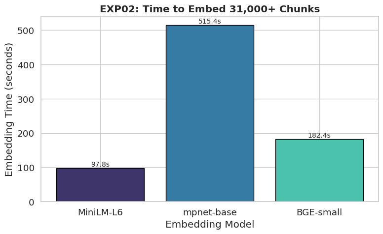

# Experiment 02: Embedding Model Comparison

### Objective
This experiment evaluates the impact of different sentence embedding models on retrieval effectiveness and computational efficiency. Since dense retrieval relies entirely on the quality of vector representations, selecting an appropriate embedding model is critical for maximizing retrieval accuracy while maintaining acceptable indexing and query latency. The experiment compares lightweight, general-purpose, and retrieval-optimized embedding models to determine the most suitable encoder for the remainder of the retrieval pipeline.

---

### Embedding Models
- `all-MiniLM-L6-v2`
- `all-mpnet-base-v2`
- `BAAI/bge-small-en-v1.5`

---

### Results Data
Here is the raw data table from the benchmark run:

---

### Accuracy Comparison

**What this means:**
The chart above shows that **BGE-small** heavily dominates all other models in accuracy. It is specifically trained for retrieval tasks, making it significantly smarter at mapping questions to the right documents than the older `MiniLM` or even the massive `MPNet` model.

**How BGE Dominates?** 
The results demonstrate a clear performance gap between general-purpose sentence embedding models and retrieval-specific embedding models. `BAAI/bge-small-en-v1.5` consistently achieved the highest Recall, Precision, MRR, and NDCG scores across the benchmark dataset, indicating superior semantic representation of both queries and documents.

Unlike `MiniLM` and `MPNet`, which were primarily designed for general semantic similarity tasks, BGE was explicitly trained for information retrieval using contrastive learning objectives. Consequently, relevant documents are mapped closer to their corresponding queries within the embedding space, resulting in significantly improved retrieval effectiveness.

---

### Speed vs. Accuracy Trade-off

**What this means:**
This scatter plot maps speed against accuracy. The best models are in the **top right** (fast and highly accurate).
- **BGE-small** is the highest point (best accuracy) while remaining fast (far right).
- **MiniLM** is slightly faster but much less accurate.

Although MPNet contains substantially more parameters than MiniLM, increased model size alone does not guarantee improved retrieval performance. The benchmark suggests that task-specific optimization contributes more to retrieval effectiveness than model capacity. Consequently, MPNet incurs significantly higher computational cost without providing proportional improvements in retrieval quality.

The latency–accuracy plot illustrates the trade-off between computational efficiency and retrieval quality. An ideal embedding model simultaneously minimizes inference latency while maximizing retrieval accuracy. BGE-small occupies the optimal region of the Pareto frontier, indicating that no competing model achieves both higher accuracy and lower latency. MiniLM provides marginally faster inference but sacrifices retrieval quality, whereas MPNet increases computational cost without corresponding performance gains.

---

### Setup Cost (Embedding Time)

**What this means:**
When building the system, every document must be processed (embedded) by the AI.
- `mpnet-base` took a huge amount of time (~224 seconds) to process our dataset.
- `BGE-small` was incredibly fast (~55 seconds), processing thousands of chunks in a fraction of the time.

Embedding generation represents a one-time offline preprocessing cost incurred during document ingestion. Although it does not directly influence online query latency, prolonged embedding time increases indexing duration and reduces system scalability when processing large document collections. Therefore, models with shorter embedding times enable faster corpus updates and more efficient deployment pipelines.

MPNet required approximately four times longer to encode the corpus than BGE-small, reflecting its greater computational complexity. In contrast, BGE-small maintained high throughput while simultaneously producing the highest-quality embeddings, demonstrating that retrieval-specific optimization can outperform larger architectures in both efficiency and effectiveness.

---

### Conclusion
Based on the benchmark results, **BAAI/bge-small-en-v1.5** offers the most favorable balance between retrieval effectiveness and computational efficiency. It consistently achieves the highest retrieval metrics while maintaining low query latency and short embedding generation time. Since no competing model demonstrated a meaningful advantage in any evaluation criterion, BGE-small was selected as the default embedding model for the remainder of the retrieval pipeline.