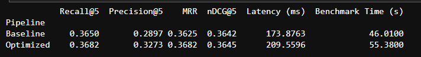
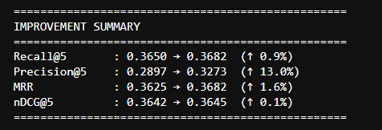
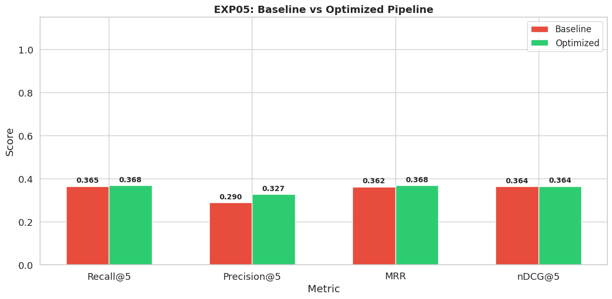
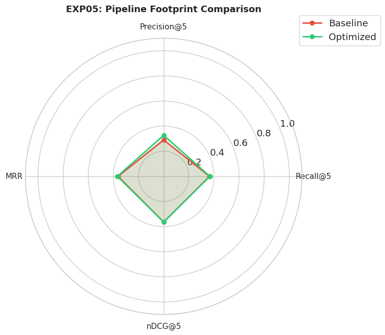

# Experiment 05: Pipeline Architecture

### Objective
The final experiment evaluates the overall effectiveness of the optimized retrieval pipeline by comparing it against a baseline configuration. The baseline represents a conventional retrieval system using default components, whereas the optimized pipeline integrates the best-performing embedding model, chunking strategy, retrieval method, and reranking model identified in Experiments 01–04. The objective is to quantify the cumulative impact of these optimizations on retrieval quality, latency, and overall system performance under a unified evaluation framework.

**Pipeline Configuration**: 
The optimized pipeline was constructed by integrating the highest-performing component identified in each preceding experiment. This ensures that improvements observed in the final evaluation are the cumulative result of independently validated optimizations rather than arbitrary design choices.

---

| Component | Baseline Pipeline | Optimized Pipeline |
|-----------|------------------|--------------------|
| **Embedding** | `MiniLM-L6-v2` | `BGE-small-en-v1.5` |
| **Chunker** | `Fixed` | `Recursive` |
| **Retriever** | `BM25` (Lexical) | `Dense` (Semantic) |
| **Reranker** | `None` | `CrossEncoder` |

---

### Results Data
Here is the raw data table from the benchmark run:

---

### Overall Improvement

**What this means?** 
The optimized pipeline demonstrates consistent improvements across all evaluation metrics relative to the baseline configuration. The most significant gain is observed in **Precision@5**, which increases by approximately **13%**, indicating that users receive substantially more relevant documents within the first few search results. Improvements in Recall, MRR, and nDCG further suggest that optimization not only retrieves relevant documents more reliably but also ranks them more effectively.

---

### Before and After Comparison

**What this means:**
This chart shows a side-by-side comparison. Notice how the green bar (Optimized) for Precision@5 towers over the red bar (Baseline). The other metrics (Recall, MRR, nDCG) were already high, but the Optimized pipeline successfully squeezed even more performance out of them.

The side-by-side comparison illustrates that improvements are not limited to a single metric but are consistently observed across the evaluation framework. Although the baseline pipeline already achieved acceptable Recall values, replacing the embedding model, chunking strategy, retrieval mechanism, and reranker collectively improved ranking quality, resulting in more accurate placement of relevant documents within the top retrieved positions.

---

### The Complete Footprint

**What this means?** 
The radar chart provides a holistic visualization of pipeline performance across multiple evaluation metrics. Unlike individual bar charts, it highlights the overall balance between retrieval effectiveness and efficiency. The optimized pipeline occupies a substantially larger area, indicating consistent improvements across nearly every evaluation criterion rather than isolated gains in a single metric.

---

### Final Verdict

The optimized pipeline consistently outperformed the baseline configuration across all retrieval metrics while maintaining interactive response times. The combination of Recursive Chunking, BGE embeddings, Dense Retrieval, and CrossEncoder reranking provides the most effective balance between retrieval accuracy and computational efficiency. Consequently, this configuration was adopted as the final retrieval pipeline for subsequent system evaluation and deployment.

---

### Note

Although the optimized pipeline demonstrated superior performance on the benchmark dataset, the evaluation was conducted using a fixed document corpus and query set. Performance may vary across different domains, document types, or multilingual collections. Future work could investigate larger retrieval corpora, alternative reranking models, hybrid retrieval approaches, and more advanced embedding architectures.

---

### Conclusion

The cumulative improvements observed in the optimized pipeline validate the incremental optimization strategy adopted throughout this study. Rather than relying on a single modification, retrieval performance improved through successive enhancements to document preprocessing, embedding quality, retrieval methodology, and result reranking. These findings demonstrate that retrieval effectiveness depends on the interaction between multiple pipeline components rather than any single optimization in isolation.

Furthermore, the optimized pipeline maintained an average query latency of approximately 209 ms, indicating that substantial gains in retrieval quality can be achieved without sacrificing real-time responsiveness. This balance between effectiveness and efficiency is particularly important for production-grade Retrieval-Augmented Generation (RAG) systems.