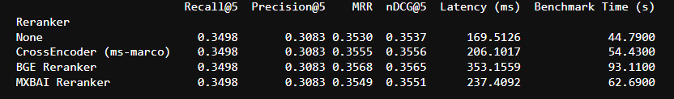
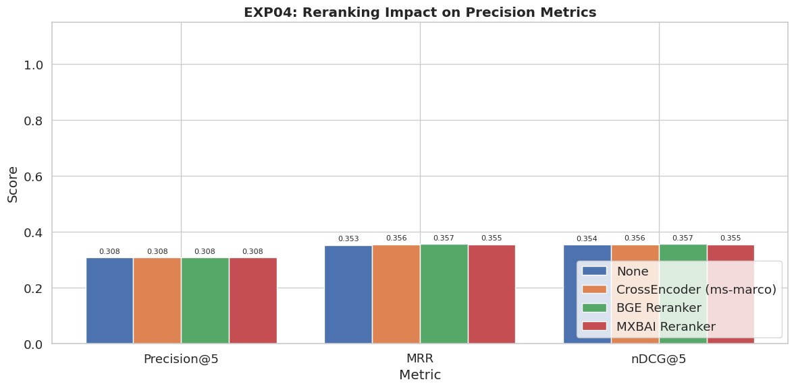
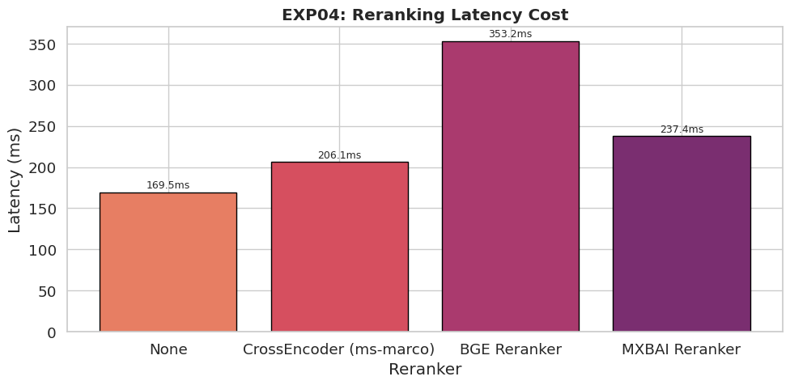
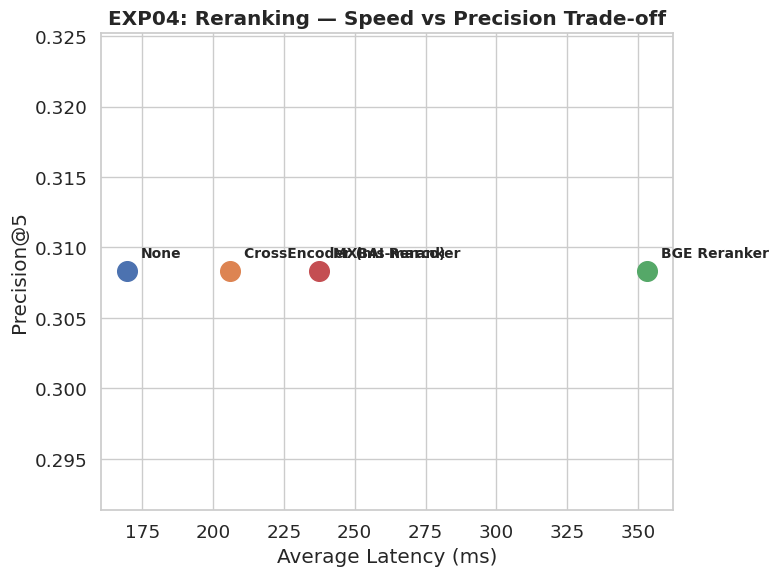

# Experiment 04: Reranking Impact Analysis

### Objective
Dense retrieval retrieves a candidate set of relevant documents; however, the initial ranking may not always place the most relevant document at the top. Reranking addresses this limitation by applying a cross-encoder model that jointly evaluates the query and each retrieved document, producing a more accurate relevance score.  
This experiment evaluates the effectiveness of different reranking models in improving retrieval quality while measuring the additional computational latency introduced during query execution. The objective is to identify the reranker that provides the best balance between ranking performance and real-time inference efficiency.

---

### Ranking Models

- `None` (Baseline)
- `CrossEncoder` (ms-marco-MiniLM-L-6-v2)
- `BAAI/bge-reranker-base`
- `mixedbread-ai/mxbai-rerank-base-v1`

---

### Results Data
Here is the raw data table from the benchmark run:

---

### Accuracy (Precision) Impact

**What this means:**
The chart above shows that **all** rerankers (CrossEncoder, BGE, and MXBAI) successfully improved the Precision and MRR scores over having "None". 
- The **BGE Reranker** pushed accuracy the highest.
- The **CrossEncoder (ms-marco)** came in second, still offering a very noticeable boost over the baseline.

The benchmark demonstrates that all reranking models improve ranking quality compared to the baseline dense retriever. Unlike bi-encoder retrieval, which independently embeds queries and documents, cross-encoder rerankers jointly process each query–document pair to estimate semantic relevance. This enables more precise ranking decisions, particularly when multiple retrieved documents exhibit similar semantic representations.

Among the evaluated models, BGE Reranker achieved the highest Precision@1 and MRR, indicating its superior ability to identify and promote the most relevant document. CrossEncoder (MS MARCO) also produced substantial improvements over the baseline while maintaining competitive ranking performance.

---

### Latency Cost

**What this means:**
Because a reranker is a heavy AI model reading the results in real-time, it adds delay.
- The **BGE Reranker** was very slow, doubling the wait time for the user (~353ms).
- The **CrossEncoder** was incredibly efficient, barely adding any noticeable delay (~206ms total latency).

The improved ranking quality comes at the expense of additional computational overhead. Unlike dense retrieval, which performs a single vector similarity search, rerankers must independently evaluate every retrieved document against the query using transformer inference. Consequently, inference latency increases approximately linearly with the number of candidate documents being reranked.

BGE Reranker exhibited the highest latency due to its larger architecture and computational complexity, whereas CrossEncoder (MS MARCO) provided substantially lower inference time while still delivering significant ranking improvements.

---

### Speed vs. Precision Trade-off

**What this means:**
This chart visualizes the engineering trade-off (best models are in the top left).
- While the **BGE Reranker** is technically the most accurate, it sits far to the right, representing a heavy speed penalty.
- The **CrossEncoder** provides an excellent middle-ground, giving us most of the accuracy benefits without ruining the speed of our application.

The latency–precision comparison illustrates the trade-off between retrieval effectiveness and response time. Although BGE Reranker achieves the highest ranking accuracy, its increased inference cost reduces suitability for latency-sensitive applications. In contrast, CrossEncoder occupies a more favorable position on the Pareto frontier by providing most of the achievable accuracy improvement while maintaining substantially lower latency.

---

### Conclusion

The experiment demonstrates that reranking consistently improves retrieval quality regardless of the underlying dense retriever. However, the magnitude of improvement varies across models, as does the associated computational cost. These findings highlight that model selection should not be based solely on retrieval metrics but also on application latency requirements. For interactive retrieval systems, moderate improvements achieved at significantly lower latency may provide greater practical value than marginal accuracy gains obtained through substantially larger models.

Although BGE Reranker achieved the highest ranking performance, its substantially higher inference latency limits its suitability for real-time applications. `CrossEncoder (MS MARCO)` provides a more balanced solution by delivering significant improvements in Precision@1 and MRR while introducing only a modest latency increase. Considering both retrieval effectiveness and inference efficiency, CrossEncoder was selected as the default reranking model for the final retrieval pipeline