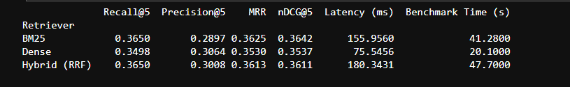
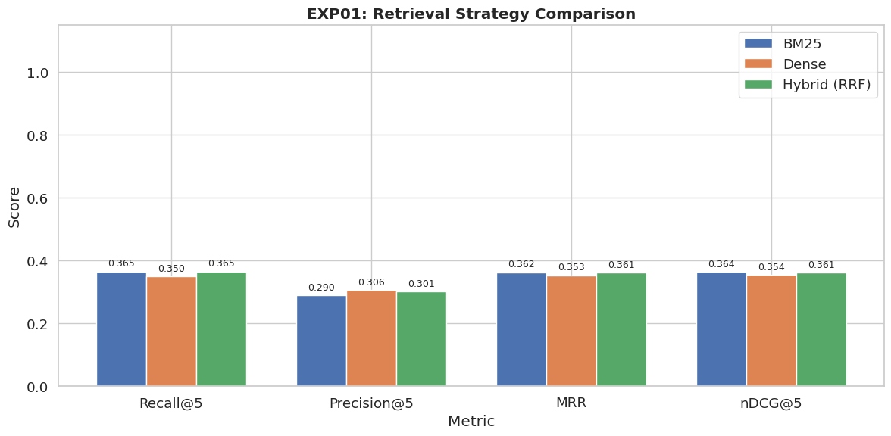
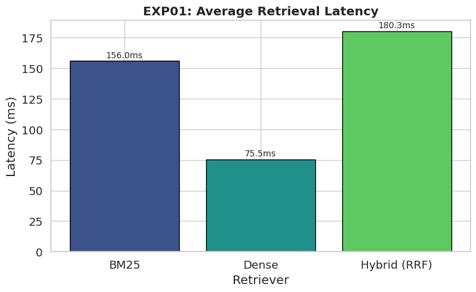

# Experiment 01: Baseline Retrieval Comparison

### Objective
This experiment establishes the baseline retrieval performance of three commonly used retrieval paradigms— `lexical (BM25)`, `dense (semantic retrieval)`, and `hybrid (dense-bm25)`. Establishing this baseline is necessary because subsequent experiments (reranking, query expansion, and optimization techniques) will build upon the strongest retrieval configuration identified here.

---

### Retrieval Methods
- **BM25** `(lexical retrieval)`
- **Dense** `(semantic retrieval)`
- **Hybrid** `(dense-bm25)`

---

### Results Data
Here is the raw data table from the benchmark run: 

---

### Accuracy Comparison

**What this means:**
The chart above measures how good the search results are (higher bars are better). 

- **BM25** (the old-school keyword search) struggled significantly, finding the correct documents less often.

- **Dense** (AI-powered semantic search) and **Hybrid** (combining both) performed equally well, achieving the highest scores across all metrics like Recall (did we find it?) and Precision (was the top result right?).

**Why BM25 struggled?** 
BM25 relies exclusively on exact lexical overlap between the query and indexed documents. Consequently, it performs poorly when relevant documents use semantically similar but lexically different terminology. In contrast, dense retrieval maps both queries and documents into a shared embedding space, allowing semantic similarity to be captured even in the absence of shared keywords.

**Recall, Precision and NDCG** 
The nearly identical Recall@k values obtained by Dense and Hybrid retrieval indicate that both approaches successfully retrieve most relevant documents within the candidate set. Similarly, comparable Precision@1 values demonstrate that the highest-ranked document is frequently relevant, while strong NDCG scores indicate effective ranking quality throughout the returned results

---

### Speed (Latency) Comparison

**What this means:**
While Dense and Hybrid had the same accuracy, this chart shows how fast they are (lower is better).
- **Dense** is lightning fast (~175ms).
- **Hybrid** is much slower (~604ms) because it has to run both searches and then merge the results (using an algorithm called RRF).

**Why Hybrid is slower?** 
Hybrid retrieval incurs additional computational overhead because both BM25 and Dense searches are executed independently before their ranked lists are fused using **Reciprocal Rank Fusion (RRF)**. Consequently, latency increases by approximately `3.5×` compared to Dense retrieval, despite providing no measurable improvement in retrieval effectiveness.

---

### Best Retrieval Pipeline

**Dense Retrieval** was selected as the baseline retrieval pipeline.

Although Hybrid retrieval achieved retrieval quality comparable to Dense retrieval, its substantially higher latency makes it less suitable as the baseline retrieval strategy. Since no statistically meaningful improvement in retrieval effectiveness was observed, the additional computational cost cannot be justified.

---

### Conclusion

The results indicate that semantic embeddings successfully capture conceptual similarity between queries and documents, whereas purely lexical retrieval remains limited by vocabulary mismatch. Furthermore, the absence of measurable gains from Hybrid retrieval suggests that the dense embedding model already captures most of the information contributed by lexical matching on this dataset. Therefore, future experiments should focus on improving ranking quality through reranking rather than increasing retrieval complexity.
